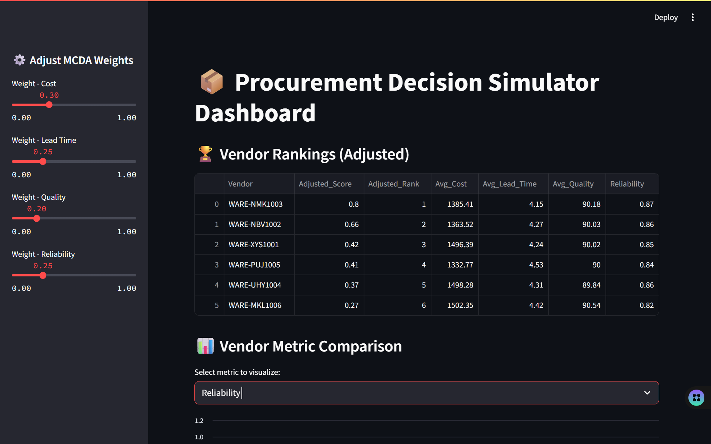
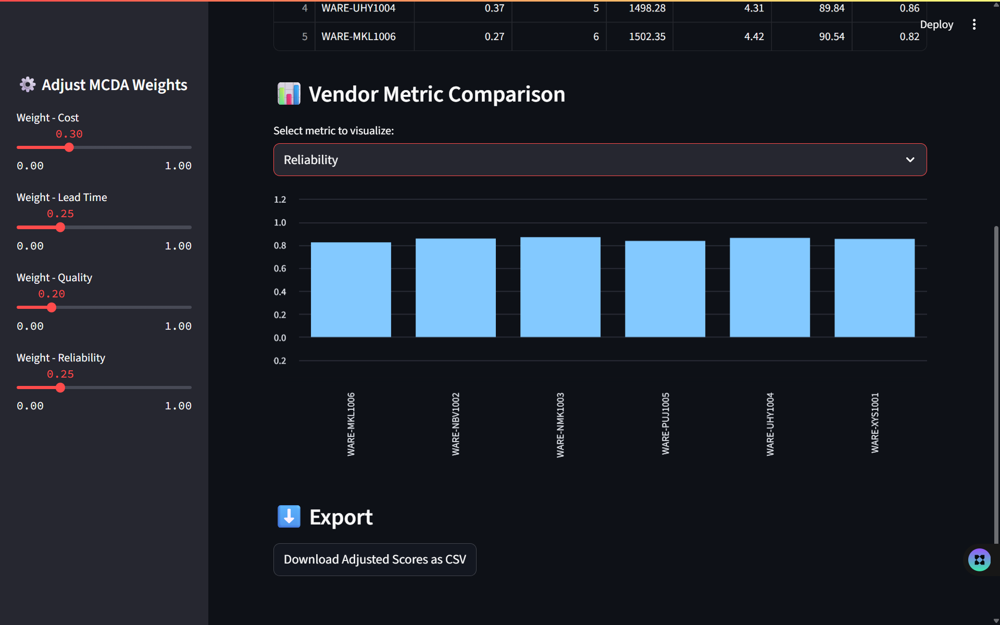

# Procurement Decision Simulator (PDS)

A Streamlit-based decision support tool that uses MCDA scoring to evaluate and rank vendors based on cost, lead time, quality, and reliability.

## Technologies Used
- Python
- Pandas
- Streamlit
- Excel
- MCDA

## Features
- Vendor scoring logic with adjustable weights
- Streamlit dashboard interface
- Excel output for analysis

